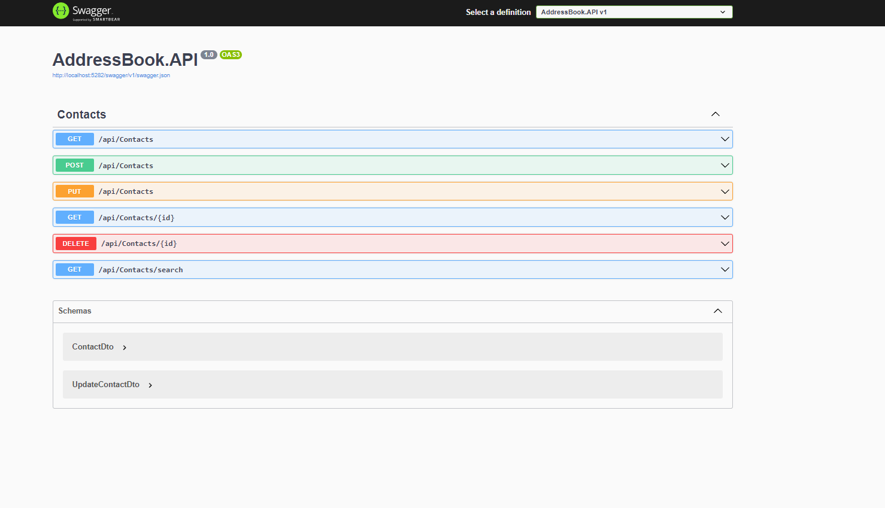
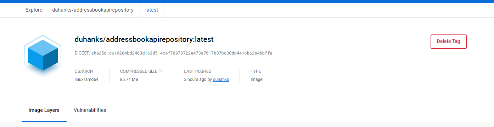
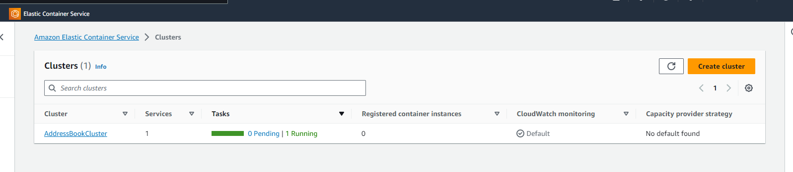

# To run the source code of my project:

This project utilizes PostgreSQL as its database. Before you can open the your IDE, you need to set the database connection string. You can do this by following the steps below:

## For Windows

1. Open a CMD (Command Prompt) window.
2. Use the following command to set the `POSTGRESQL_CONNECTION_STRING` environment variable:

   ```shell
   setx POSTGRESQL_CONNECTION_STRING "YOUR_CONNECTION_STRING"
   
## For Linux or Mac

1. Open a CMD (Command Prompt) window.
2. Use the following command to set the `POSTGRESQL_CONNECTION_STRING` environment variable:

   ```shell
   export POSTGRESQL_CONNECTION_STRING="YOUR_CONNECTION_STRING"


# Endpoints
## URL: .../swagger/index.html



# Docker Image
## The project has been uploaded to Docker Hub as a [Docker Image](https://hub.docker.com/layers/duhanks/addressbookapirepository/latest/images/sha256-d619204bd2463d163d514cef7d973722e473a7617b87bc30dd4416b62e4bbffe?context=repo).
Note: To run Image, you need to declare the database connection.



# AWS Elastic Container Service
## The project's [Docker Image](https://hub.docker.com/layers/duhanks/addressbookapirepository/latest/images/sha256-d619204bd2463d163d514cef7d973722e473a7617b87bc30dd4416b62e4bbffe?context=repo) has been deployed to production using AWS Elastic Container Service



